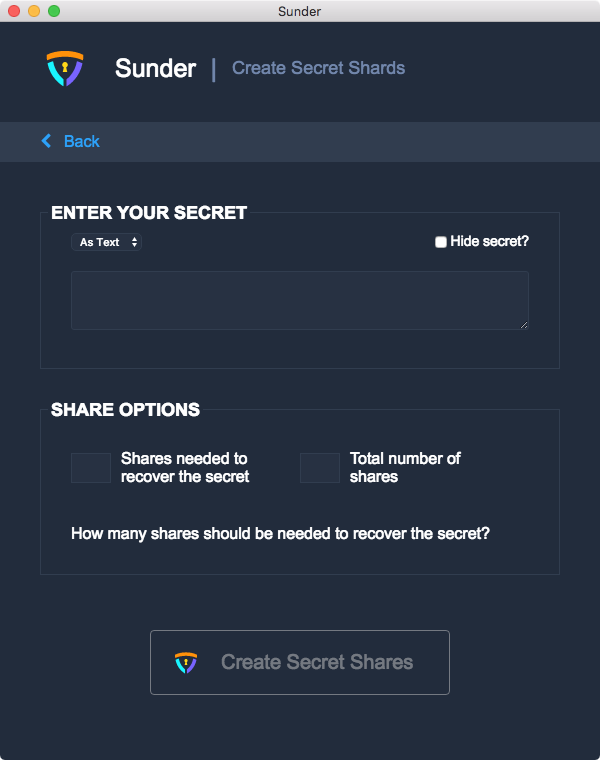
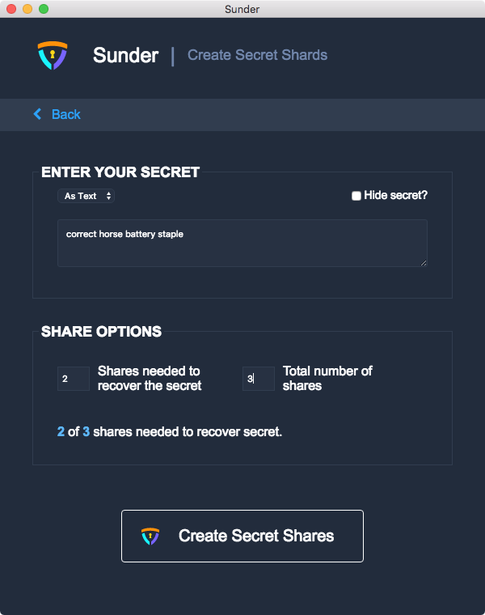
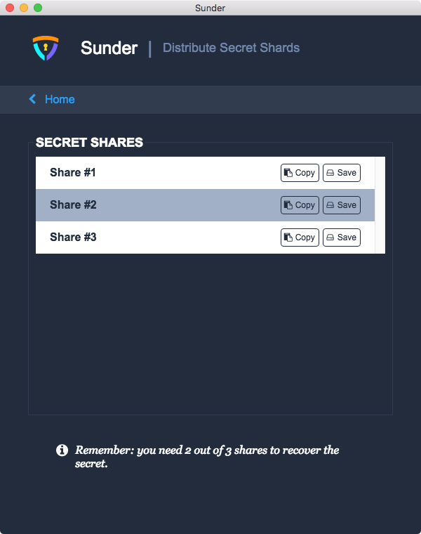

Generate Secret Shares
======================

Before you begin,
prepare the following:

#. The secret to be shared. Sunder accepts text or file input.
#. The size of the group. This can be any number greater than 1.
#. The size of the quorum. This can be any number between 2 and the size of the group.

Open Sunder.
The first thing you will see is the home screen, with two buttons: **Sunder It** and **Recover It.**

.. image:: images/sunder_home.png

To generate secret shares, click **Sunder It**.

There are two sections on the **Create Secret Shards** page:
**Enter Your Secret** and **Share Options**.

If you wish to enter your secret as text,
leave the **Enter Your Secret** dropdown menu set to **As Text**
and type or paste your secret into the text box.
You may choose to toggle the **Hide secret?** checkbox
to hide the secret text.

If you wish to enter your secret as a file,
click the dropdown menu and select **From File**.
Click the **Select File** button to open a file picker.
You may choose any file up to 1MB in size for your secret.

In **Share Options**,
enter the size of the quorum in **Shares needed to recover the secret**
and the size of the group in **Total number of shares**.
Sunder validates the group and quorum parameters as you type them
and will warn you if they're invalid.

Once the form is filled and all of the values are valid,
the **Create Secret Shares** button will be enabled.
Click **Create Secret Shares**.

On the **Distribute Secret Shards** page,
you are presented with a list of the generated secret shares.
You can export each secret share by clicking
**Copy** to copy it to the clipboard or
**Save** to save it to a file.
You should export each secret share
and securely distribute it to the designated share holder.

Once you're done distributing the shares,
you may either click **< Home** to return to the home screen
and continue using Sunder,
or use the menu to quit Sunder.
