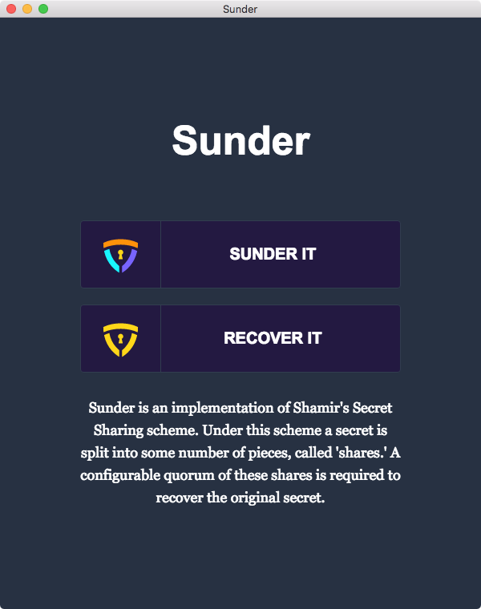
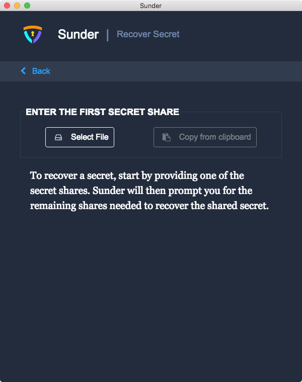
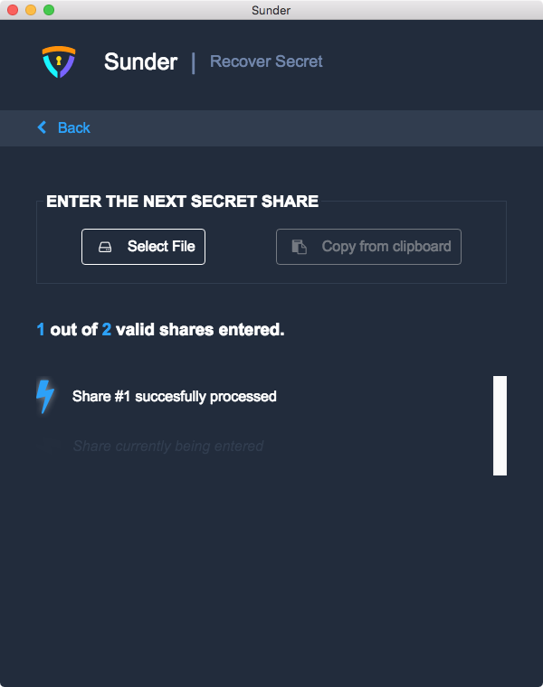
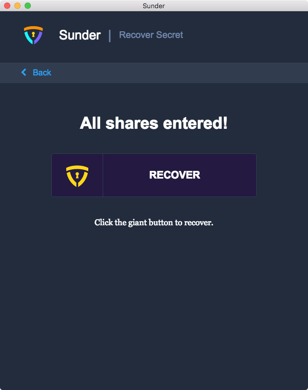
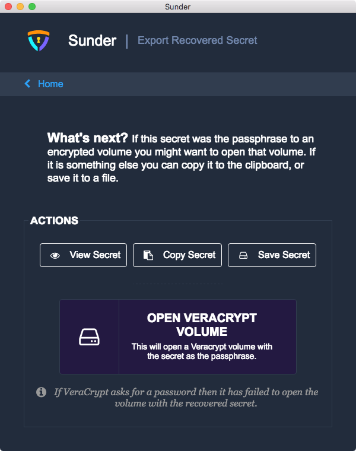

Recover a Secret
================

Before you begin,
convene a quorum of secret share holders with their secret shares.

Open Sunder.
The first thing you will see is the home screen, with two buttons: **Sunder It** and **Recover It**.

To recover a shared secret, click **Recover It**.

You will be prompted to provide the secret shares,
one at a time.
To load a secret share from a file, click **Select File**.
To load a secret share from the clipboard, click **Copy from clipboard**.

Each secret share contains a copy of the secret sharing parameters that were chosen when the shares were generated.
Once the first secret share is processed,
Sunder starts a running total
and will prompt you for each remaining secret share
necessary to reach the quorum.

Once you've entered the final share,
the list of shares will change into a big **Recover** button.
Click **Recover** to finish recovering the secret.

On the **Export Recovered Secret** page,
you have several options for actions to take with the recovered secret.

- **View Secret** displays the recovered secret as text in a dialog.
- **Copy Secret** copies the recovered secret to the clipboard.
- **Save Secret** opens a dialog for you to save the recovered secret to a file.

If you have Veracrypt installed,
you will also see an **Open Veracrypt Volume** button.
This is meant to facilitate a specific workflow
wherein a Veracrypt volume is protected with a secret shared passphrase.
You may click **Open Veracrypt Volume** to open a file picker,
and choose a Veracrypt volume.
Sunder will attempt to open the Veracrypt volume,
using the recovered secret as the passphrase for the volume.
